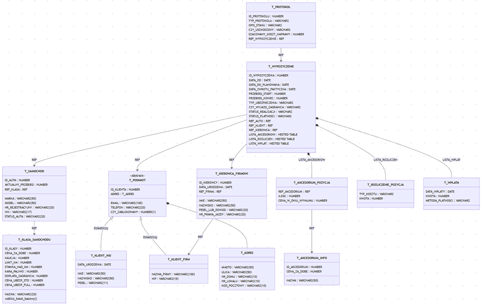

# 🚗 Car Rental Object-Relational Database (ORDB)

## 📖 Project Overview
This project is an advanced implementation of a car rental management system developed using the **Object-Relational Database (ORDB)** model in Oracle. It focuses on optimizing data structures through object-oriented features while maintaining relational integrity.

The system handles two distinct client types (Individual and Corporate), automated billing, car fleet status tracking, and rental lifecycle management.

## 🛠️ Tech Stack
- **Database Engine:** Oracle Database
- **Languages:** SQL, PL/SQL
- **Modeling:** Entity-Relationship Diagram (ERD) / Object-Relational Mapping

## 📐 Database Architecture

*Figure 1: Object-Relational schema showcasing inheritance and complex relationships.*

## 🌟 Key Technical Features
- **Type Inheritance:** Implemented a base type `t_podmiot` with specialized subtypes for individual and business clients (`t_klient_ind`, `t_klient_firm`).
- **Nested Collections:** Utilized `NESTED TABLE` for managing rental history, accessories, and payments within a single record to reduce join overhead.
- **PL/SQL Packages:** Encapsulated business logic into modular packages:
  - `pkg_wynajem`: Handling reservations, payments, and car distribution.
  - `pkg_zwroty`: Processing car returns, damage reports, and automated fine calculation.
- **Business Triggers:** Automated age verification (21+ policy) and odometer fraud protection.

## 📁 Repository Structure
- `sql/`: Contains the complete SQL script including type definitions, tables, and packages.
- `docs/`: Full technical report (PDF) detailing the normalization process and roles.
- `images/`: Database diagrams and architectural visualizations.

## 👥 Credits
Developed in collaboration as a university engineering project.  
- **Lead Developer:** Adrianna Kostrzewa  
- **Project Partner:** University Collaborator
